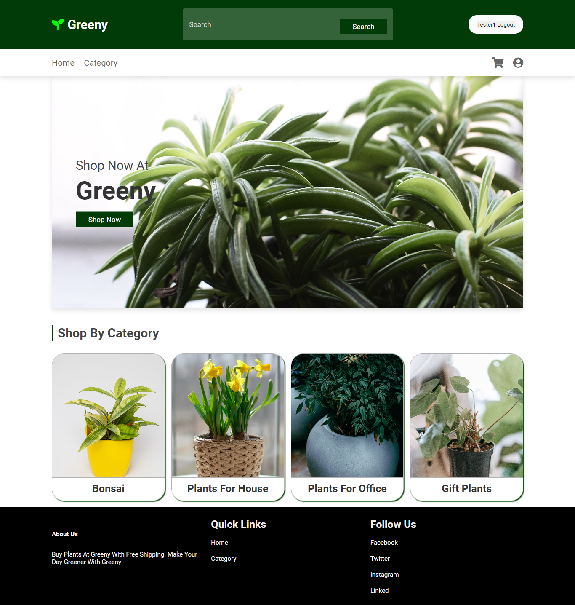

# oibsip_taskno_2
# Portfolio Website

This repository contains a portfolio website with four webpages: `index.html`, `project.html`, `article.html`, and `contact.html`. Each webpage serves a different purpose and showcases the author's work and skills. Below, we will briefly describe each of these webpages and the content they contain.

## Deployed Website

You can access the deployed portfolio website at the following link:
[Portfolio Website](https://ashutosh-aditya.github.io/oibsip_taskno_2/)

## Index Page (`index.html`)

This is the homepage of the portfolio website, featuring the author, Ashutosh Aditya. It includes the following sections:

- **Name and Introduction:** The webpage starts with the author's name and a brief introduction.
- **Skills:** It lists the author's skills, including programming languages, technologies, and tools.
- **About:** A brief description of the author's background, achievements, and aspirations.

## Project Page (`project.html`)

This webpage showcases a project titled "E-Commerce Website." It provides information about the project, including:

- **Project Name:** "Greeny"
- **Description:** An e-commerce website developed using HTML, CSS, JavaScript, PHP, and MySQL with admin controls.
- **Key Features:** Details about the user-friendly frontend, admin controls, and backend functionality.
- **GitHub Repository:** A link to the project's GitHub repository for further exploration.

## Article Page (`article.html`)

This webpage presents two articles:

**Article 1:**
- **Title:** "Article-1"
- **Content:** A Lorem Ipsum placeholder text.
- **Image:** A relevant image.

**Article 2:**
- **Title:** "Article-2"
- **Content:** Another Lorem Ipsum placeholder text.
- **Image:** Another relevant image.

## Contact Page (`contact.html`)

This webpage provides contact information for Ashutosh Aditya, including:

- **Phone Number:** 9852229122
- **Email Address:** adityaashutosh06@gmail.com
- **GitHub Profile:** [https://github.com/Ashutosh-aditya](https://github.com/Ashutosh-aditya)

## Navigation

All webpages include a navigation menu at the top, allowing users to switch between pages. The menu contains links to the homepage (`index.html`), the project page (`project.html`), the articles page (`article.html`), and the contact page (`contact.html`).

## Additional Styling

The website is styled using CSS to provide a clean and user-friendly interface. Bootstrap 4 is also used for some styling elements.

## Interactivity

The project details on the "Project" page and the articles on the "Article" page have "Show More" buttons to reveal additional information when clicked. This interactivity is achieved using JavaScript.

Feel free to explore the different webpages to learn more about Ashutosh Aditya's work and skills.

This README provides an overview of the portfolio website, and you can access the deployed site by following the link provided above.

